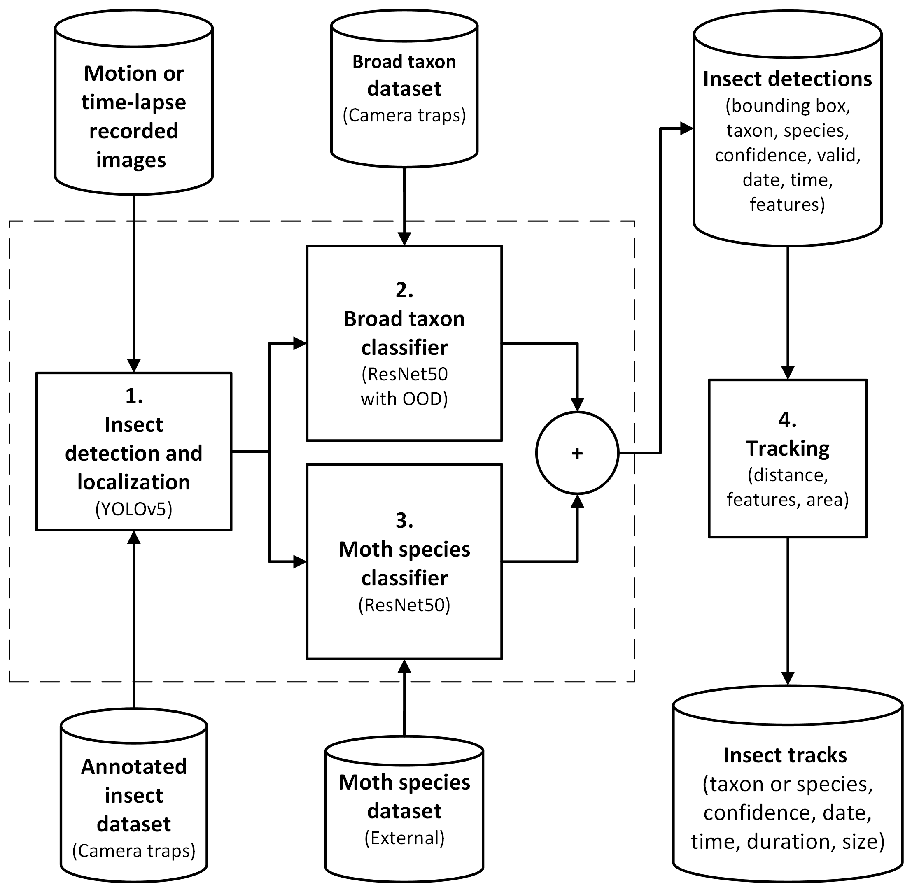
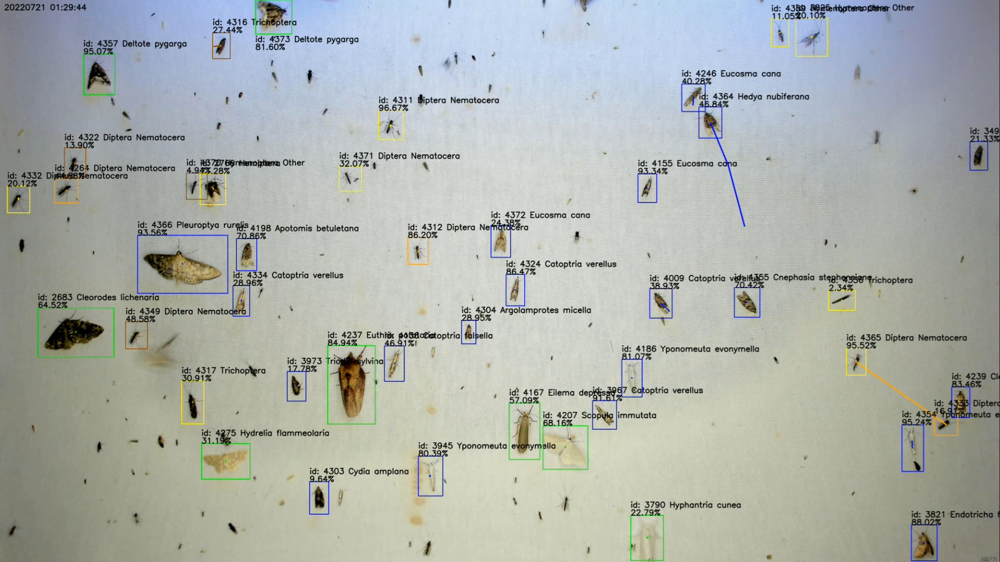

# MCC24-trap #
This project contains Python code for processing time-lapse and motion images from the AMI traps (detection, classification and tracking)
The repository contains Python code for steps 1-4 in figure below. 

The datasets used for training the nocturnal insect detector and broad taxon classifier can be found on Zenodo:
https://zenodo.org/records/15105293

The work and results are described in the paper: "Towards edge processing of images from insect camera traps"
https://www.biorxiv.org/content/10.1101/2024.07.01.601488v2 (Preprint)
https://zslpublications.onlinelibrary.wiley.com/doi/full/10.1002/rse2.70007 (Published 17. April 2025)

## Python environment files ##
envreq.txt - environment requirements

condaInstall.sh - edit file to install conda environment on Linux

raspberryInstall.sh - bash script to install Python environment on RaspberryPi 4 and 5

## Python source code files, configuration, models and scripts ##

### Test images - one night of four hours with high activity of insects (>6,000 images)

https://drive.google.com/file/d/17ABGAg3b7hmxW4DbfI7wwZp4iU_PpbAB/view?usp=drive_link

See below video with annotated tracks of classified insects (broad taxonomic groups and moth species) based on the test images:

### YOLOv5 weights for insect detection and localisation (m6 and s6 models)

https://drive.google.com/file/d/12aQpXF7T1YD3PSltI3J5gp4gZ4JQ689A/view?usp=drive_link

The modified YOLOv5 code is an older version of the repository from: https://github.com/ultralytics/yolov5

### Getting started ###
The edge computer requires an internet connection the first time the insect detector and classifier are executed. 
During this initial run, the model files for the moth species classifier will be downloaded. 
For all subsequent executions of the detector, classifier, and tracker, an internet connection is not needed.

1. Install the environment requirements condaInstall.sh (Linux with Anaconda)

   If running on Raspberry Pi 4 or 5 use the raspberryInstall.sh script.

3. Download and unpack the YOLOv5 weights and test images - see the drive.google.com links above

4. Activate python environment

   - Anaconda: $ conda activate PyTorch_AMI

   - Rasberry Pi: $ source /home/pi/venv/bin/activate

6. Run the insect detector and classifiers (Use the *s6.pt or *m6.pt YOLOv5 weights)

	python detectClassifySpecies.py --weights insectMoths-bestF1-1280m6.pt --result results --img 1280 --conf 0.20 --nosave --source (add path to test images)
   
7. Modify trackInsects.py and the configuration file for insect tracking: ITC_config.json (set path for results.csv and results.npy)
   
8. Run the insect tracker:

	python trackInsects.py

### Insect order and species classifier files ###

The directories ami, common and ml contains code copied and modified from: 

https://github.com/RolnickLab/ami-data-companion

ami - species classifier models 

common - species classifier code

ml - species classifier code

orderClassifier.py - broad taxon classifier code 

orderAndSpeciesClassifier.py - combined broad taxon and species classifier

resnet50.py - model used for order classifier 

model_order_100524 - contains the newest ResNet50 model weights for broad taxon classifier and thresholds with 15 groups of taxon labels

## Training and testing insect detector model ##

### YOLOv5 object detector files ###
data - YOLO configuration yaml files

models - YOLO yaml models and code

utils - YOLO source code

### Training YOLOv5 insect detector ###
trainF1.py

trainInsectsMoths.sh

### Validate YOLOv5 insect detector ###
val.py

testInsectsMoths.sh

## Detecting, classifying and tracing insects ##

### Combined YOLOv5 detection, ResNet50 broad taxon and species classifier (Steps 1.-3.) ###
detectClassifyInsects.py - Detector and broad taxon classifier

detectClassifySpecies.py - Detector, broad taxon and species classifier

insectMoths-bestF1-1280m6.pt - YOLOv5m6 medium model trained to detect insects

insectMoths-bestF1-1280s6.pt - YOLOv5s6 small model trained to detect insects

CSV - contains CSV files with detections and npy files with features

Content of *.csv files which contain lines for each detection (YYYYMMDD.csv):

	year,trap,date,time,detectConf,detectId,x1,y1,x2,y2,fileName,orderLabel,orderId,orderConf,aboveTH,key,speciesLabel,speciesId,speciesConf

### Insect tacking  (Step 4.) ###
trackInsects.py - performs tracing of insects based on CSV and NPY files generated from combined YOLOv5 detector and ResNet50 classifier 
                  (Set useSpeciesPredictions=True for using the moth species classifier predictions, else tracking for broad taxon only)

ITC_config.json - configuration file for insect tracking

idac - source files used for insect tracking

tracks - contains CSV and JSON files with tracks for every date (YYYMMDD*)

Content of *TR.csv files which contain lines for each track: 

	id,startdate,starttime,endtime,duration,class,counts,percentage,size,distance
 
Content of *TRS.csv files which contain lines for each detection related to track id: 

	id,key,date,time,confidence,valid,order,species,xc,yc,x1,y1,width,height,image
 
## Plotting, making movies and printing results ##
createMoveiCSV.py - Create movies based on the detection and classification CSV files without tracking

plotResultsBroadTaxon.py - Plotting results for tracking with broad taxon classifier (tracking without moth species classifier)

plotResultsMothSpecies.py - Plotting results for tracing with broad taxon and moth species classifier

plotSampleTimeResults.py - Plotting results for comparing tracking and different time-lapse sampling intervals

printStatistics.py - Calculating and printing statistics for tracking and broad taxon classifications

